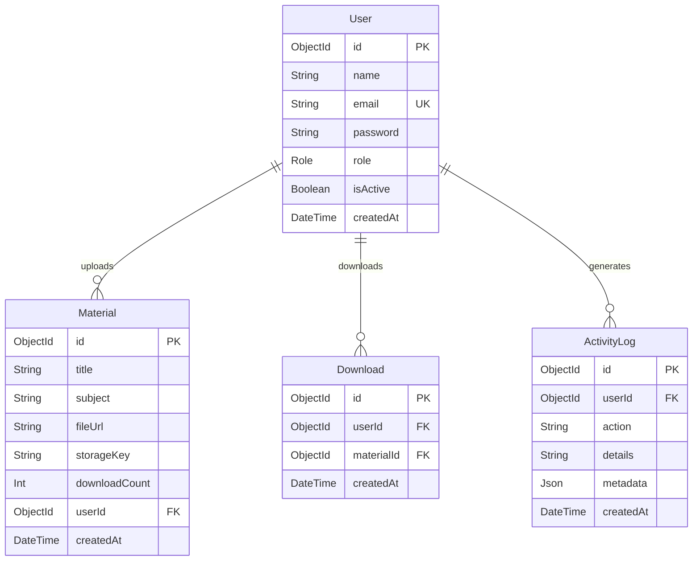

<div align="center">


[](https://github.com/soumyadip9mondal/StudyQ)

<p>
  
  
  
  
  
  
  
</p>

</div>

---

## ✨ Overview

**StudyQ** is a full-stack educational platform where **students** browse and download study materials, **teachers** upload content, and **admins** manage users — all with role-based access control, analytics, and a premium dark-mode UI.

Built as a **Turborepo monorepo** with end-to-end type safety via shared Zod schemas.

---

## 🏗️ Architecture

```
StudyQ/
├── apps/
│   ├── api/                    @studyq/api — Express backend
│   │   ├── src/
│   │   │   ├── core/middleware/    requireAuth, errorHandler
│   │   │   └── modules/           Vertical slices
│   │   │       ├── auth/          register, login, refresh, logout
│   │   │       ├── materials/     upload, list, download, delete
│   │   │       ├── admin/         user CRUD, audit log
│   │   │       └── analytics/     role-based stats, trends
│   │   └── .env
│   └── web/                    @studyq/web — React frontend
│       ├── src/
│       │   ├── components/         ui/, layout/, RoleGuard
│       │   ├── features/           Vertical slices
│       │   │   ├── auth/           api, hooks, views
│       │   │   ├── materials/      api, hooks, views
│       │   │   ├── dashboard/      api, hooks, views
│       │   │   ├── admin/          api, hooks, views
│       │   │   └── landing/        views
│       │   ├── store/uiStore.ts    UI-only Zustand
│       │   └── lib/                axiosClient, queryClient
│       └── .env
└── packages/
    ├── shared/                 @studyq/shared — Zod schemas
    │   └── src/schemas/            user.schema.ts, material.schema.ts
    └── database/               @studyq/database — Prisma + MongoDB
        ├── prisma/schema.prisma
        └── src/index.ts            PrismaClient singleton
```

---

## 🛠️ Tech Stack

### Backend (`apps/api`)
| Technology | Purpose |
|------------|---------|
| **Express.js** | HTTP server |
| **Prisma** | MongoDB ORM |
| **JWT** | HTTP-only cookie auth |
| **Helmet** | Security headers |
| **Multer** | File uploads |
| **Zod** | Request validation (from `@studyq/shared`) |
| **bcryptjs** | Password hashing |
| **express-rate-limit** | Rate limiting |

### Frontend (`apps/web`)
| Technology | Purpose |
|------------|---------|
| **React 18** | UI library |
| **Vite** | Build tool |
| **React Query** | Server state (queries, mutations, cache) |
| **Zustand** | UI state only (theme, sidebar, session) |
| **Tailwind CSS** | Styling |
| **Framer Motion** | Animations |
| **Radix UI** | Accessible primitives |
| **Recharts** | Analytics charts |
| **Lucide React** | Icons |

### Shared (`packages/shared`)
| Technology | Purpose |
|------------|---------|
| **Zod** | Schema validation + type inference |

> Types are _inferred_ from Zod schemas — never written manually. Both `apps/api` and `apps/web` import from `@studyq/shared`.

---

## 🚀 Getting Started

### Prerequisites
- **Node.js** ≥ 18
- **pnpm** ≥ 8
- **MongoDB** (local or Atlas)

### Setup

```bash
# 1. Clone
git clone https://github.com/soumyadip9mondal/StudyQ.git
cd StudyQ

# 2. Install dependencies (all workspaces)
pnpm install

# 3. Configure environment
# Edit apps/api/.env with your MongoDB URI and secrets
# Edit apps/web/.env with your API URL

# 4. Push Prisma schema to MongoDB
cd packages/database
npx prisma db push

# 5. (Optional) Seed admin user
npx tsx src/seed.ts
# Creates: admin@studyq.com / admin123

# 6. Start both servers
cd ../..
pnpm dev
```

Both servers start via Turborepo:
- **API**: `http://localhost:4000`
- **Web**: `http://localhost:5173`

---

## 🔐 Roles & Permissions

| Feature | Student | Teacher | Admin |
|---------|:-------:|:-------:|:-----:|
| Browse & download materials | ✅ | ✅ | ✅ |
| Upload materials | ❌ | ✅ | ✅ |
| Delete own materials | ❌ | ✅ | ✅ |
| View own analytics | ✅ | ✅ | ✅ |
| Create/manage users | ❌ | ❌ | ✅ |
| View audit log | ❌ | ❌ | ✅ |

---

## 📡 API Reference

Base URL: `http://localhost:4000/api`

### Auth
| Method | Endpoint | Auth | Description |
|--------|----------|------|-------------|
| `POST` | `/auth/register` | ❌ | Register as student |
| `POST` | `/auth/login` | ❌ | Login (sets JWT cookie) |
| `POST` | `/auth/refresh` | 🍪 | Silent token refresh |
| `POST` | `/auth/logout` | 🍪 | Clear cookies |
| `GET` | `/auth/me` | 🔒 | Get current user |

### Materials
| Method | Endpoint | Auth | Description |
|--------|----------|------|-------------|
| `GET` | `/materials` | 🔒 | List (paginated, filterable) |
| `POST` | `/materials` | 🔒👨‍🏫 | Upload file (multipart) |
| `POST` | `/materials/:id/download` | 🔒 | Track download |
| `DELETE` | `/materials/:id` | 🔒👨‍🏫 | Soft delete |

### Admin
| Method | Endpoint | Auth | Description |
|--------|----------|------|-------------|
| `GET` | `/admin/users` | 🔒👑 | List users |
| `POST` | `/admin/users` | 🔒👑 | Create user |
| `PATCH` | `/admin/users/:id` | 🔒👑 | Update user |
| `DELETE` | `/admin/users/:id` | 🔒👑 | Deactivate user |
| `GET` | `/admin/audit-log` | 🔒👑 | View admin actions |

### Analytics
| Method | Endpoint | Auth | Description |
|--------|----------|------|-------------|
| `GET` | `/analytics/stats` | 🔒 | Role-based dashboard stats |
| `GET` | `/analytics/downloads` | 🔒 | 7-day download trend |
| `GET` | `/analytics/subjects` | 🔒 | Subject breakdown |

> 🔒 = JWT cookie required &nbsp;|&nbsp; 👨‍🏫 = Teacher/Admin &nbsp;|&nbsp; 👑 = Admin only &nbsp;|&nbsp; 🍪 = Cookie-based

---

## 🔑 Core Design Rules

1. **Types come from Zod** — `z.infer<typeof Schema>`, never manual interfaces
2. **Zustand = UI state only** — theme, sidebar, user session
3. **React Query = server state** — all API data managed via queries/mutations
4. **Controllers are thin** — `Schema.parse()` → service → response
5. **Services talk to DB** — no `req`/`res` in services
6. **Frontend never imports Prisma** — only `apps/api` uses `@studyq/database`
7. **JWT in HTTP-only cookies only** — never in localStorage, Zustand, or response body

---

## 🗄️ Database Models



---

## 🤝 Contributing

1. Fork the repo
2. Create a feature branch: `git checkout -b feature/my-feature`
3. Make changes in the appropriate workspace
4. Run `pnpm turbo run type-check` to verify types
5. Commit & push: `git push origin feature/my-feature`
6. Open a Pull Request

---

<div align="center">

**Built with ❤️ by [Soumyadip Mondal](https://github.com/soumyadip9mondal)**


</div>
