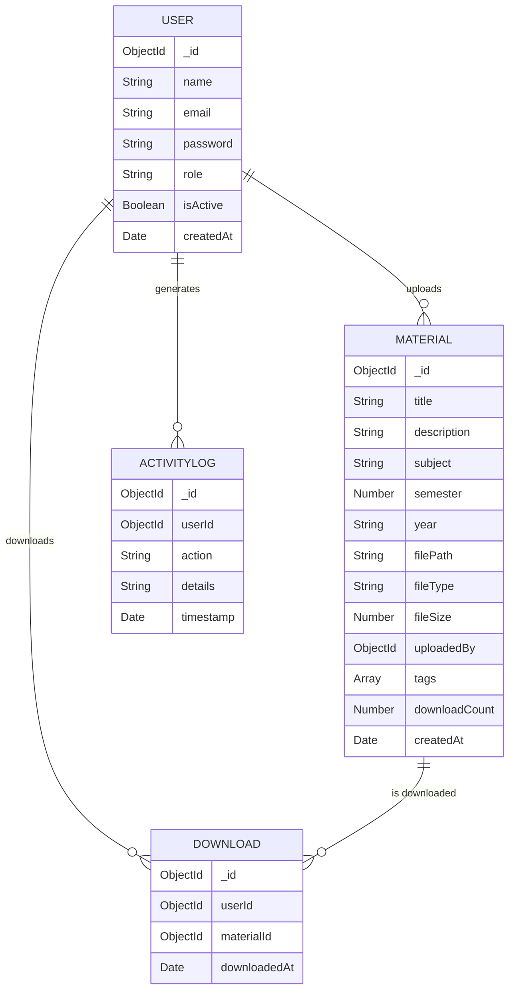

<div align="center">

<!-- Animated Header -->


<!-- Typing Animation -->
[](https://github.com/soumyadip9mondal/StudyQ)

<br/>

<!-- Badges -->


<br/>


</div>

## 🎯 Overview

**StudyQ** is a production-ready, full-stack educational content management and delivery system. It enables seamless distribution of study materials from **teachers** to **students** through a secure, role-based platform with a beautiful animated UI, dark mode support, and an interactive dashboard.

<div align="center">
<table>
<tr>
<td align="center">🔐</td>
<td><b>Role-Based Access</b> — Admin, Teacher & Student roles with granular permissions</td>
</tr>
<tr>
<td align="center">📚</td>
<td><b>Material Management</b> — Upload, organize, search & download study resources</td>
</tr>
<tr>
<td align="center">📊</td>
<td><b>Analytics Dashboard</b> — Track usage, downloads & system-wide stats via interactive charts</td>
</tr>
<tr>
<td align="center">🌙</td>
<td><b>Dark Mode</b> — Fully themed dark/light modes with seamless transitions</td>
</tr>
<tr>
<td align="center">🎨</td>
<td><b>Animated UI</b> — Framer Motion powered transitions, hover effects & micro-interactions</td>
</tr>
<tr>
<td align="center">🛡️</td>
<td><b>Secure by Default</b> — JWT auth, Helmet, rate limiting, bcrypt & Zod validation</td>
</tr>
</table>
</div>


## ✨ Features

<details>
<summary><b>🔐 Authentication & Security</b></summary>
<br/>

| Feature | Description |
|---------|-------------|
| JWT Authentication | Access + Refresh token system with HTTP-only cookies |
| Password Hashing | bcrypt with configurable salt rounds |
| Role-Based Access Control | Admin, Teacher, and Student roles |
| Rate Limiting | Express rate limiter to prevent brute-force attacks |
| Helmet Protection | HTTP security headers out of the box |
| Input Validation | Zod schemas for request validation & sanitization |
| CORS Configuration | Configurable cross-origin policies |

</details>

<details>
<summary><b>👥 User Management</b></summary>
<br/>

| Feature | Description |
|---------|-------------|
| Admin-only User Creation | No self-registration, controlled by admin |
| Role Assignment | Assign Admin / Teacher / Student roles |
| User Search & Filter | Find users by name, email, role or status |
| Account Activation | Toggle user active/inactive status |
| Password Reset | Admin-initiated password resets |
| Activity Logging | Track all user actions via audit logs |

</details>

<details>
<summary><b>📚 Material Management</b></summary>
<br/>

| Feature | Description |
|---------|-------------|
| File Upload | Multer-based upload with file type & size validation |
| Metadata Tagging | Subject, semester, year, tags & descriptions |
| Search & Filter | Full-text search with semester/subject filters |
| Download Tracking | Track download counts and history per material |
| Teacher Scoping | Teachers manage only their own materials |
| Role-Based Visibility | Students see only permitted materials |

</details>

<details>
<summary><b>📊 Analytics & Dashboard</b></summary>
<br/>

| Feature | Description |
|---------|-------------|
| Interactive Charts | Recharts-powered bar, line & pie charts |
| System Statistics | Total users, materials, downloads at a glance |
| Activity Logs | Timestamped audit trail for all operations |
| User Analytics | Per-user download history and activity |
| Role-Based Views | Different dashboard views per role |

</details>

<details>
<summary><b>🎨 UI/UX</b></summary>
<br/>

| Feature | Description |
|---------|-------------|
| Animated Landing Page | Framer Motion hero section with scroll animations |
| Sliding Auth Page | Interactive sign-in/sign-up with CSS transform animations |
| Dark/Light Mode | Full theme support with Tailwind's dark mode |
| Collapsible Sidebar | Clean navigation with expand/collapse |
| Radix UI Components | Accessible dialogs, dropdowns, tabs, select menus |
| Responsive Design | Mobile-first responsive layouts |
| Micro-interactions | Hover effects, transitions & loading skeletons |

</details>


## 🏗️ Architecture

```
StudyQ/
├── 📁 src/                    # React Frontend (Vite + TypeScript)
│   ├── 📁 components/
│   │   ├── 📁 layout/         # DashboardLayout, Sidebar, Header
│   │   ├── 📁 ui/             # Reusable Radix-based UI primitives
│   │   └── RoleGuard.tsx      # Route protection by role
│   ├── 📁 pages/
│   │   ├── Landing.tsx        # Animated landing page
│   │   ├── AuthPage.tsx       # Sliding sign-in / sign-up
│   │   ├── Dashboard.tsx      # Role-based dashboard
│   │   ├── Materials.tsx      # Browse & download materials
│   │   ├── Upload.tsx         # Teacher material upload
│   │   ├── Analytics.tsx      # Charts & statistics
│   │   └── AdminPanel.tsx     # User management (Admin only)
│   ├── 📁 store/              # Zustand state management
│   ├── 📁 lib/                # Axios client & utilities
│   ├── App.tsx                # Router & auth initialization
│   └── index.css              # Global styles & Tailwind directives
│
├── 📁 server/                 # Express.js Backend
│   └── 📁 src/
│       ├── 📁 config/         # Environment & DB configuration
│       ├── 📁 middleware/     # Auth, rate limit, error handling
│       ├── 📁 models/         # Mongoose schemas
│       │   ├── User.ts
│       │   ├── Material.ts
│       │   ├── Download.ts
│       │   └── ActivityLog.ts
│       ├── 📁 routes/         # API route handlers
│       │   ├── auth.ts        # Login, register, refresh, logout
│       │   ├── admin.ts       # User CRUD (admin only)
│       │   ├── materials.ts   # Material CRUD + downloads
│       │   └── analytics.ts   # Stats & activity logs
│       ├── 📁 scripts/        # Seed scripts & utilities
│       └── index.ts           # Server entry point
│
├── 📁 public/                 # Static assets
├── .env                       # Environment variables
├── vite.config.ts             # Vite configuration
├── tailwind.config.js         # Tailwind theme & plugins
├── tsconfig.json              # TypeScript configuration
└── package.json               # Dependencies & scripts
```


## 🛠️ Tech Stack

<div align="center">

### Frontend

| Technology | Purpose |
|:---:|:---|
|  | **React 18** — Component-based UI with hooks |
|  | **TypeScript 5.5** — Static type safety |
|  | **Vite 5** — Lightning-fast dev server & bundler |
|  | **Tailwind CSS 3.4** — Utility-first styling with dark mode |
| 🎞️ | **Framer Motion 12** — Declarative animations & transitions |
| 🧩 | **Radix UI** — Accessible headless UI components |
| 📊 | **Recharts 3** — Composable charting library |
| 🐻 | **Zustand 5** — Lightweight state management |
| 🌐 | **Axios** — HTTP client with interceptors |
| 🧭 | **React Router 7** — Client-side routing |

### Backend

| Technology | Purpose |
|:---:|:---|
|  | **Node.js** — JavaScript runtime |
|  | **Express 4** — Minimal, flexible web framework |
|  | **MongoDB** — NoSQL document database |
| 🍃 | **Mongoose 8** — Elegant MongoDB ORM |
| 🔑 | **JWT** — Stateless authentication tokens |
| 🔒 | **bcryptjs** — Secure password hashing |
| 🛡️ | **Helmet** — HTTP security headers |
| ✅ | **Zod 4** — TypeScript-first schema validation |
| 📁 | **Multer** — Multipart file upload handling |
| ⏱️ | **express-rate-limit** — Request throttling |

</div>


## 🚀 Getting Started

### Prerequisites

- **Node.js** v18+ and **npm**
- **MongoDB** (local or [MongoDB Atlas](https://www.mongodb.com/atlas))

### 1️⃣ Clone the Repository

```bash
git clone https://github.com/soumyadip9mondal/StudyQ.git
cd StudyQ
```

### 2️⃣ Install Dependencies

```bash
# Frontend dependencies
npm install

# Backend dependencies
cd server
npm install
cd ..
```

### 3️⃣ Configure Environment

Create a `.env` file in the project root:

```env
# MongoDB
MONGO_URI=mongodb://localhost:27017/studyq

# JWT Secrets
JWT_SECRET=your-super-secret-jwt-key
JWT_REFRESH_SECRET=your-refresh-secret-key

# Cookie
COOKIE_SECRET=your-cookie-secret-key

# Server
PORT=3001
CORS_ORIGIN=http://localhost:5173

# Frontend
VITE_API_URL=http://localhost:3001/api
```

### 4️⃣ Start the Development Servers

```bash
# Terminal 1 — Start the backend
cd server
npm run dev

# Terminal 2 — Start the frontend
npm run dev
```

| Service  | URL                      |
|----------|--------------------------|
| Frontend | http://localhost:5173     |
| Backend  | http://localhost:3001     |
| API Base | http://localhost:3001/api |


## 🔗 API Reference

<details>
<summary><b>🔐 Authentication</b></summary>

```http
POST   /api/auth/login             # Login with credentials
POST   /api/auth/register          # Register new user
POST   /api/auth/refresh           # Refresh access token (cookie-based)
POST   /api/auth/logout            # Logout & clear cookies
POST   /api/auth/change-password   # Change current password
```
</details>

<details>
<summary><b>👤 Admin — User Management</b></summary>

```http
GET    /api/admin/users            # List all users
POST   /api/admin/users            # Create new user
PUT    /api/admin/users/:id        # Update user details
DELETE /api/admin/users/:id        # Delete user
POST   /api/admin/users/:id/reset-password   # Reset user password
```
</details>

<details>
<summary><b>📚 Materials</b></summary>

```http
GET    /api/materials              # List materials (filtered by role)
POST   /api/materials              # Upload material (teacher/admin)
PUT    /api/materials/:id          # Update material metadata
DELETE /api/materials/:id          # Delete material
GET    /api/materials/:id/download # Download material file
```
</details>

<details>
<summary><b>📊 Analytics</b></summary>

```http
GET    /api/analytics/stats        # System-wide statistics
GET    /api/analytics/activity     # Activity log entries
GET    /api/analytics/downloads    # Download analytics
```
</details>


## 🗂️ Database Models




## 🔐 Roles & Permissions

| Permission | 🛡️ Admin | 👨‍🏫 Teacher | 🎓 Student |
|:---|:---:|:---:|:---:|
| View Dashboard | ✅ | ✅ | ✅ |
| Browse Materials | ✅ | ✅ | ✅ |
| Download Materials | ✅ | ✅ | ✅ |
| Upload Materials | ✅ | ✅ | ❌ |
| Edit Own Materials | ✅ | ✅ | ❌ |
| Delete Own Materials | ✅ | ✅ | ❌ |
| View Analytics | ✅ | ✅ | ✅ |
| Manage Users | ✅ | ❌ | ❌ |
| Admin Panel Access | ✅ | ❌ | ❌ |
| System Statistics | ✅ | ❌ | ❌ |


## 🛡️ Security Measures

<div align="center">

```
🔑 JWT Access + Refresh Tokens    🔒 bcrypt Password Hashing
🛡️ Helmet HTTP Headers            ⏱️ Rate Limiting
✅ Zod Input Validation            🍪 HTTP-Only Secure Cookies
🚫 CORS Policy Enforcement        📝 Full Audit Logging
```

</div>


## 🤝 Contributing

Contributions are welcome! Here's how to get started:

```bash
# 1. Fork the repository
# 2. Create your feature branch
git checkout -b feature/awesome-feature

# 3. Make your changes and commit
git commit -m "feat: add awesome feature"

# 4. Push to your branch
git push origin feature/awesome-feature

# 5. Open a Pull Request 🎉
```

## 📄 License

This project is licensed under the **MIT License** — see the [LICENSE](LICENSE) file for details.

---

<div align="center">


**Built with ❤️ by [Soumyadip Mondal](https://github.com/soumyadip9mondal)**

<a href="https://github.com/soumyadip9mondal/StudyQ/stargazers">
  
</a>
&nbsp;
<a href="https://github.com/soumyadip9mondal/StudyQ/network/members">
  
</a>
&nbsp;
<a href="https://github.com/soumyadip9mondal/StudyQ/issues">
  
</a>

<br/>

⭐ **Star this repo if you find it useful!** ⭐

</div>
